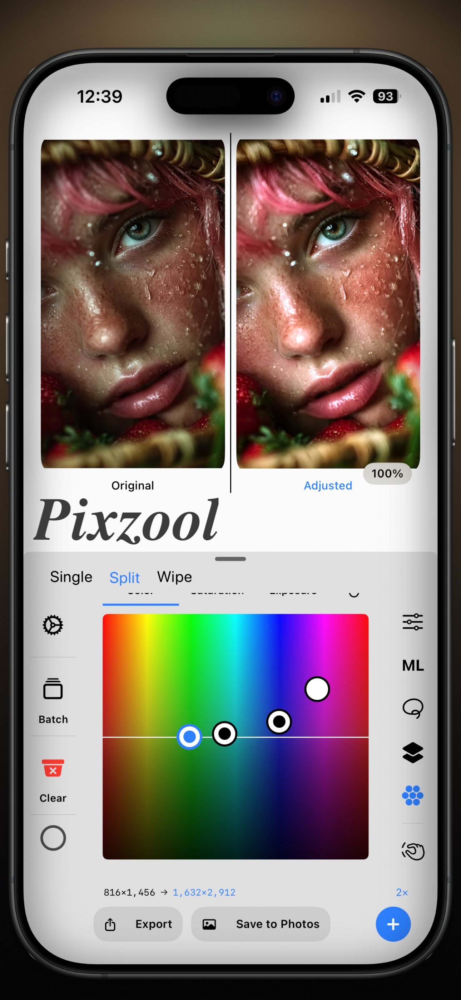

# Pixzool (Used to be Pixzool-mini)
## Professional photo and video restoration, enhancement, and editing tools, all in one place.

ENHANCE YOUR MEDIA

PHOTO AI ENHANCER
	Whether you want to enlarge a small image, sharpen a blurry photo, reduce compression noise, clean up artifacts, or make anime and illustrations High Quality, Pixzool gives you dedicated tools and control over the result.

VIDEO AI ENHANCER
Enhance video with dedicated Double and Quadruple models, including x2 Math, x2 and x4 Helex, x4 Oryn (GPU Optimized) , x2 and x4 Nitro, and x2 and x4 Anima. Keep the source frame rate or render at 30 fps or 60 fps. Preview the video, compare the result, and preserve audio.
	Fantastic for turning blurry, low-quality videos into crisp 4K Ultra HD

BATCH PROCESSING FOR PHOTOS
	Queue and process up to 100 photos in one batch. Apply the selected enhancement setup across the queue and follow each item's progress.

AI STRENGTH FOR PHOTOS AND VIDEOS
	Fine-tune how strongly AI enhancement affects the result. Use the AI Strength control to choose the balance between the resized source and the AI-enhanced output.

TOOLS IN THE WORKSTATION

GLOBAL CONTROLS FOR PHOTOS AND VIDEOS
	Brightness, contrast, saturation, and sharpness
	Curves for Master RGB, luminance, red, green, and blue

LAYERS FOR PHOTOS AND VIDEOS
	27 layer blend modes
	Layer opacity and fill
	Add, duplicate, enable, disable, remove, reorder, nest, and merge layers
	Add multiple effects within a layer

EFFECTS FOR PHOTOS AND VIDEOS
	60+ Effects across Color, Blur, Style, Detail, and Distort categories
	Color correction, blur, grain, halftone, pixel, toon, noise reduction, sharpening, sketch, edge, and distortion tools
	Provided Effects Controls — Intensity, Rotation, X-Y Positioning, Sizing and Effect-specific controls When supported
	Pixzool also Supports Editing values of your Effects with Hand Gesture Controlles on your Photos or Videos Canvas For better experience

MASKING FOR PHOTOS AND VIDEOS
	Provided Controls — Mask density, feathering, inversion, and overlay preview controls
	Masks Available — Luminance, Linear gradient, and Radial Gradient masking options
	Intelligent Masks  — Automatic Subject Detection, Automatic groups of people Detection.
	Pixzool can detect each person in a photo and create an independent color-coded masks per person layer for every detected person.

BEFORE AND AFTER
Compare photo and video results with Single, Split, and draggable Wipe views before saving.

AI ENHANCEMENT OPTIONS
	Photo AI Models — 2x Standard, 2x Secondary, 4x Standard, 4x Secondary, 4x UltraSharp, 4x Aggressive, 4x Anime + Artifact cleaner
	Video AI Models — x2 Math, x2 Helex, x4 Helex, x4 Oryn, x2 Nitro, x4 Nitro, x2 Anima, and x4 Anima.

EXPORT AND RECOVERY
Export processed photos and videos through Files or save them to Photos. Restore supported media references, settings, layers, effects, masks, and batch queues after relaunch.

What can you Use Pixzool for?
	Enhance and enlarge low-resolution photos and videos
	Restore blurry, noisy, pixelated, or compressed media
	Increase resolution for prints and high-resolution displays
	Increase or decrease video frame rates
	Improve icons, digital artwork, anime, and illustrations
	Enhance portraits, textures, animals, and nature photography
	Reduce noise and JPEG compression artifacts
	Build detailed edits with layers, effects, and masks
	Process multiple photos in one batch
	Edit private photos and videos without uploading them to a cloud AI service

YOUR PRIVACY MATTERS
Your photo and video enhancement work is processed on device. Pixzool does not upload your media to a cloud AI service for editing or enhancement.

Terms of Use: https://www.apple.com/legal/internet-services/itunes/dev/stdeula/
Privacy Policy: https://www.pixzool.app/privacy

----------------------------------------------------------------------------------------------------------------------------------------
OLD/Legacy starting below
# Pixzool-mini
Pixzool Mini is a lightweight (19.2 mb) local and native macOS application. Pixzool Mini requires no internet and all actions performed stay on your own device. Pixzool Mini is a derivative and minified version of a full suit application I am working on

  

  <a href="https://github.com/marshiyar/Pixzool-mini/stargazers">
    <strong>⭐ If you like this repo, give it a star</strong>
  </a>

  

### Special Qualities

- local ** 2x and 4x** AI Upscaling
- Offline
- **19.2 MB** App
- Blazing Fast

### Features

- AI Strength
   - 0-100% strength control — Best way to avoid overly cooked results and synthetic AI look!
   
- Adjustments tab
   - Brightness Control
   - Contrast Control
   - Saturation Control
   - Sharpness Controll

- View Modes
   - Single Mode ( when upscaled it will show your upscaled version) * with space-bar you can toggle between before and after!
   - Split section — show's both before and after at the same time.
   - Wipe view
     

  
  
  

